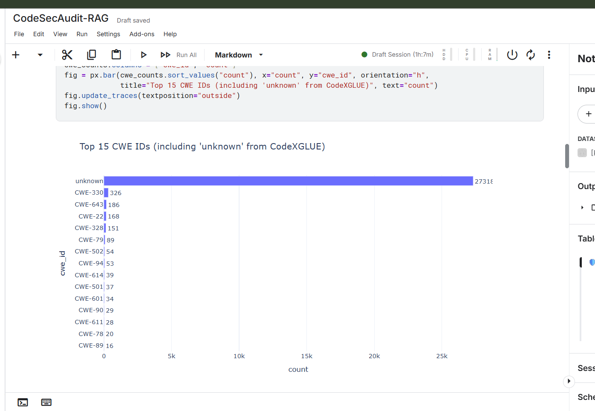
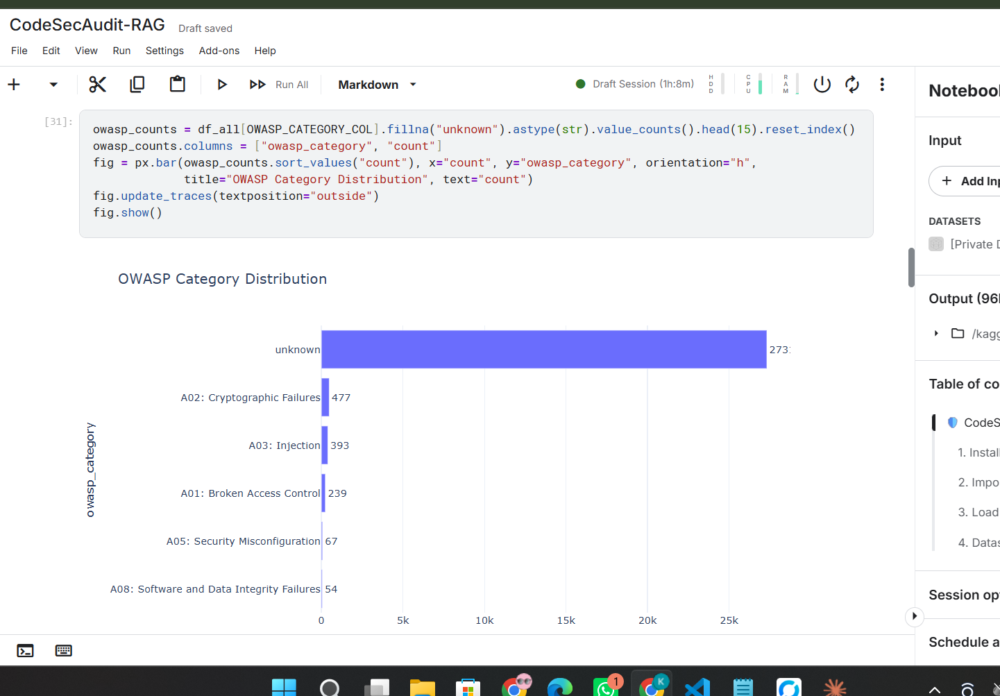
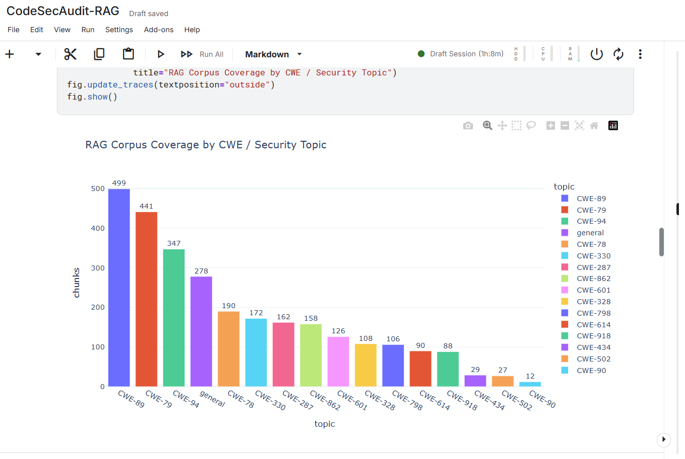
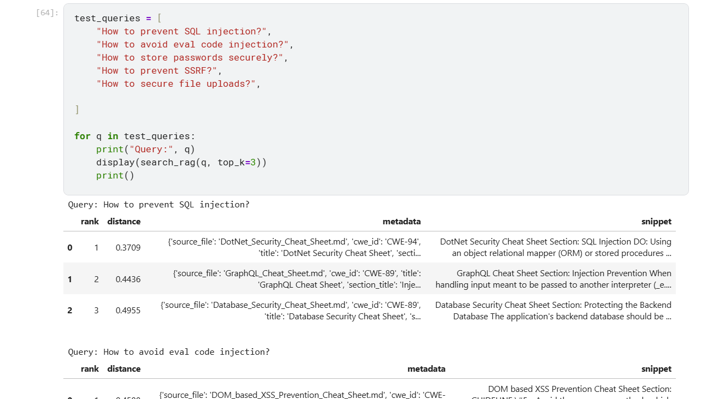
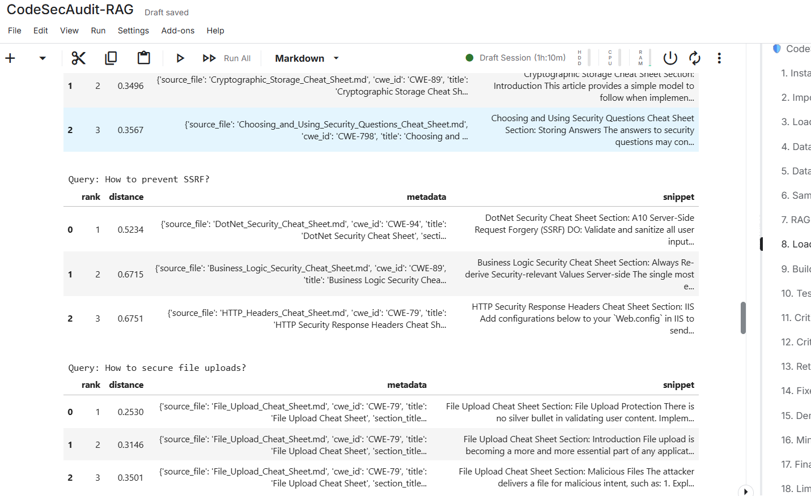
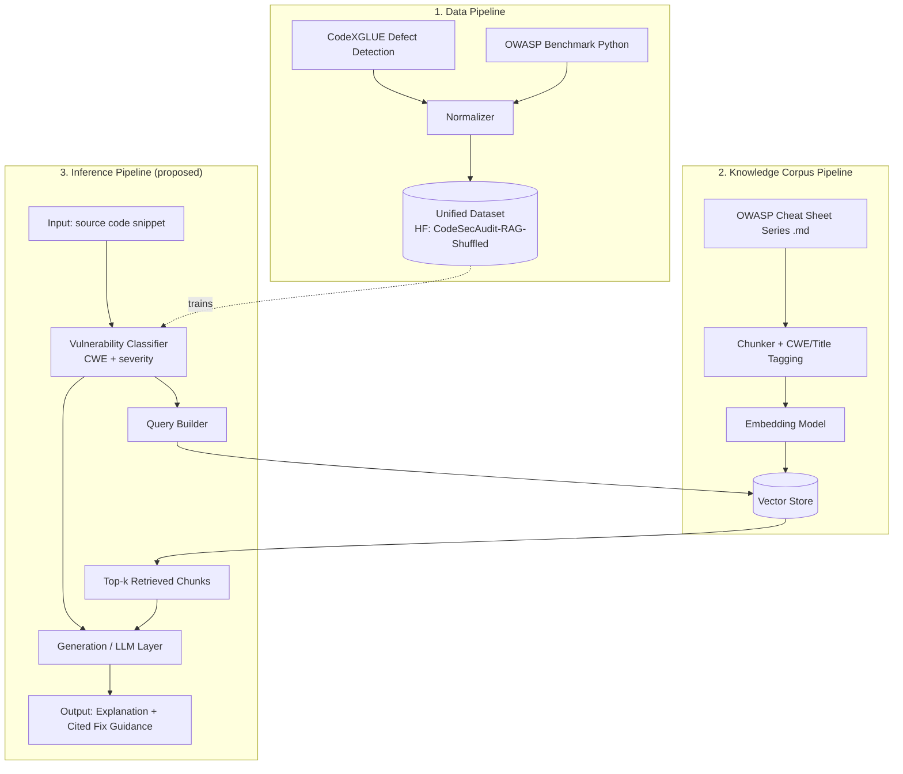
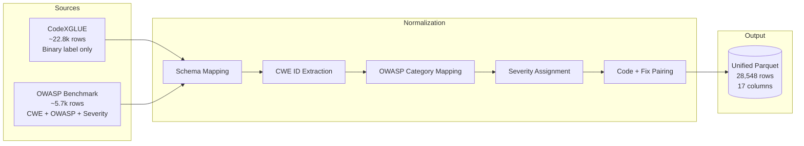
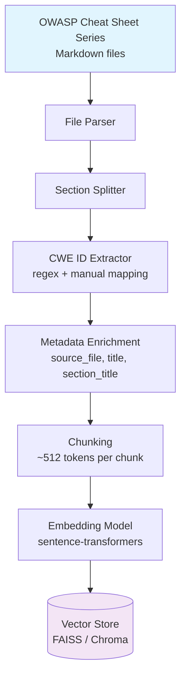
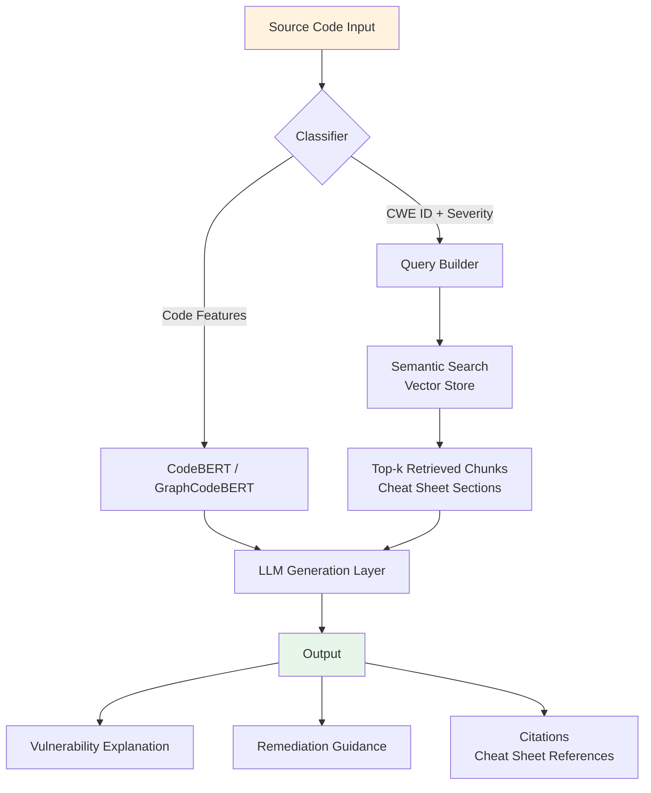
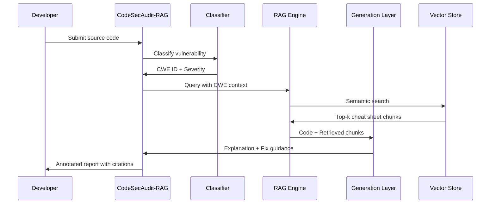

# CodeSecAudit-RAG

**A Retrieval-Augmented pipeline for source-code vulnerability detection and security-fix guidance**, built on a unified, CWE/OWASP-labeled vulnerability dataset and a cheat-sheet-grounded retrieval corpus.

- Dataset (HF): [`hitenvk22/CodeSecAudit-RAG-Shuffled`](https://huggingface.co/datasets/hitenvk22/CodeSecAudit-RAG-Shuffled)
- Prototype notebook (Kaggle): [`CodeSecAudit-RAG`](https://www.kaggle.com/code/hitenkatariya/codesecaudit-rag)

## Live Deployment

| Service | URL |
|---|---|
| Website | [codesecaudit.vercel.app](https://codesecaudit.vercel.app) |
| Backend API (docs) | [codesecaudit-backend.onrender.com/docs](https://codesecaudit-backend.onrender.com/docs) |
| RAG Service | [codesec-rag-service.onrender.com](https://codesec-rag-service.onrender.com/) |

> **Status:** Dataset engineering + RAG retrieval prototype complete. Classification/generation layer and evaluation are in progress — see [What's Left](#whats-left--in-progress).

---

## 1. Problem Statement

Static analyzers flag vulnerable code but rarely explain *why* it's vulnerable in a way a developer can act on, and most public vulnerability datasets (e.g. CodeXGLUE) only carry a **binary defective/not-defective label** with no CWE, no OWASP category, and no fix guidance.

CodeSecAudit-RAG addresses this in two parts:

1. **A unified, richly-labeled vulnerability dataset** — normalizing multiple public sources into one schema carrying CWE ID, OWASP Top-10 category, severity, and vulnerability name.
2. **A Retrieval-Augmented Generation (RAG) layer** over the OWASP Cheat Sheet Series, so that a detected vulnerability can be paired with authoritative, CWE-tagged remediation guidance instead of a generic label.

---

- Dataset: https://huggingface.co/datasets/hitenvk22/CodeSecAudit-RAG-Shuffled
- Notebook: https://www.kaggle.com/code/hitenkatariya/codesecaudit-rag


## 2. What's Done

### 2.1 Dataset Engineering

Combined and normalized two public sources into one schema and published it on Hugging Face:

| Source | Type | Role |
|---|---|---|
| CodeXGLUE Defect Detection | C code, binary label only | Bulk vulnerability/non-vulnerability signal |
| OWASP Benchmark (Python) | Labeled test cases | CWE ID + OWASP category + severity ground truth |

**Dataset stats** (`hitenvk22/CodeSecAudit-RAG-Shuffled`):
- **28,548 rows total** — Train: 22.8k · Validation: 2.85k · Test: 2.88k
- Stored as auto-converted Parquet, split by `source_split`
- Unified schema per row: `id, source_name, source_type, language, framework, task, cwe_id, owasp_category, severity, is_vulnerable, vulnerability_name, input_code, fixed_code, explanation, secure_pattern, tags, metadata`

**Class distribution (EDA):**


*Fig 1 — CWE distribution across the combined dataset. CodeXGLUE's binary-only labels dominate as `unknown`; OWASP Benchmark contributes the labeled long tail (CWE-330, CWE-643, CWE-22, CWE-328, CWE-79, etc.).*


*Fig 2 — Same imbalance viewed by OWASP Top-10 category: A02 (Cryptographic Failures), A03 (Injection), and A01 (Broken Access Control) are the best-represented labeled categories.*

> **Known limitation, called out honestly:** the `unknown` bucket (~27.3k rows) reflects CodeXGLUE's lack of CWE/OWASP labels, not an actual dominant vulnerability class. This needs to be resolved before the dataset is used for supervised CWE classification (see below).

### 2.2 RAG Corpus Construction

- Parsed and chunked the **OWASP Cheat Sheet Series** (Markdown source docs — e.g. Cryptographic Storage, File Upload, DotNet Security, GraphQL, Business Logic, HTTP Headers cheat sheets).
- Each chunk tagged with metadata: `source_file`, `cwe_id`, `title`, `section_title`.
- Embedded and indexed for similarity search.


*Fig 3 — Corpus coverage by CWE/security topic. Strongest coverage on CWE-89 (SQL Injection), CWE-79 (XSS), and CWE-94 (Code Injection); thinner coverage on CWE-90, CWE-502, CWE-434.*

### 2.3 Retrieval Prototype & Qualitative Testing

Built a `search_rag(query, top_k)` function and ran it against a fixed set of natural-language security questions to sanity-check retrieval quality:

```python
test_queries = [
    "How to prevent SQL injection?",
    "How to avoid eval code injection?",
    "How to store passwords securely?",
    "How to prevent SSRF?",
    "How to secure file uploads?",
]
```


*Fig 4 — Retrieval results for each test query, ranked by distance, with source cheat sheet, CWE ID, and snippet.*


*Fig 5 — Close-up: top-ranked chunks correctly surface the DotNet SSRF section and File Upload Cheat Sheet sections for their respective queries, with low distance scores (0.25–0.52) indicating strong relevance.*

**Early observation:** top-1 retrieval consistently returns the topically-correct cheat sheet section (e.g. SQL injection → DotNet/GraphQL/Database Security cheat sheets; file upload → File Upload Cheat Sheet), which validates the chunking + metadata tagging strategy before investing in a generation layer on top.

---

### Used Dataset 
Here are the direct links to the official repositories and databases for the datasets and resources you listed:

**CodeXGLUE Defect Detection**

* **Link:** [github.com/microsoft/CodeXGLUE/.../Defect-detection](https://github.com/microsoft/CodeXGLUE/tree/main/Code-Code/Defect-detection)
* **Details:** Hosted in Microsoft's official CodeXGLUE repository, this specific dataset (based on the Devign framework) contains C source code used to train models to identify security defects like resource leaks and use-after-free vulnerabilities.

**OWASP Benchmark (Python)**

* **Link:** [github.com/OWASP-Benchmark](https://github.com/OWASP-Benchmark)
* **Details:** While the flagship OWASP Benchmark was originally built for Java, community ports and adaptations for Python exist under this GitHub organization to evaluate Python vulnerability detection tools.

**OWASP Cheat Sheet Series**

* **GitHub Link:** [github.com/OWASP/CheatSheetSeries](https://github.com/OWASP/CheatSheetSeries)
* **Web Link:** [cheatsheetseries.owasp.org](https://cheatsheetseries.owasp.org/)
* **Details:** While this is a collection of application security guides rather than a code dataset, the raw Markdown files for the entire series are hosted openly on this GitHub repository.

**"Later Sources"**

* **Details:** This is **not a standalone dataset**. Because you are pulling from a list of security datasets, it is highly likely that you copied this from a table in a research paper or systematic review. In literature reviews, "Later Sources" is a common categorical header used to describe datasets or studies found *after* the original search protocol was conducted.

**OWASP Benchmark (Java)**

* **Link:** [github.com/OWASP/Benchmark](https://www.google.com/search?q=https://github.com/OWASP/Benchmark)
* **Details:** The official, flagship OWASP test suite. It is a fully runnable open-source Java web application designed to evaluate the speed, coverage, and accuracy of automated vulnerability detection tools.

**NIST Juliet Test Suite for Java (v1.3)**

* **Link:** [samate.nist.gov/SARD/test-suites/111](https://www.google.com/search?q=https://samate.nist.gov/SARD/test-suites/111)
* **Details:** Hosted by the NIST Software Assurance Reference Dataset (SARD) project, this contains nearly 29,000 synthetic Java programs with known, documented flaws mapped to specific Common Weakness Enumerations (CWEs).

**NIST Juliet Test Suite for C/C++ (v1.3)**

* **Link:** [samate.nist.gov/SARD/test-suites/112](https://samate.nist.gov/SARD/test-suites/112)
* **Details:** Also hosted on NIST SARD, this is the C/C++ equivalent containing thousands of test cases with intentional vulnerabilities (like buffer overflows) alongside fixed versions of the code to test tool discrimination.

## 3. What's Left / In Progress

| Area | Gap | Planned Next Step |
|---|---|---|
| Label quality | ~96% of combined dataset has `unknown` CWE/OWASP (CodeXGLUE limitation) | Either restrict supervised classification training to the OWASP-Benchmark-labeled subset, or weak-label CodeXGLUE rows via the RAG layer / a CWE classifier |
| Retrieval evaluation | Only qualitative (eyeballing top-k snippets) | Add quantitative metrics: Precision@k, Recall@k, MRR against a held-out labeled query set |
| Classification model | Not yet trained | Fine-tune a code-vulnerability classifier (e.g. CodeBERT/GraphCodeBERT) on the labeled subset, output CWE + severity |
| Generation layer | Retrieval-only right now | Add an LLM generation step that takes (flagged code + retrieved cheat-sheet chunks) → produces a plain-English explanation + fix suggestion, grounded in citations |
| End-to-end pipeline | Dataset and RAG corpus are still separate notebooks | Wire classifier output → RAG query → generation into one pipeline function |
| Serving | Notebook-only prototype | Wrap as an API (FastAPI) + minimal UI for a reviewer/demo-able tool |
| Testing | No formal test suite | Add unit tests for chunking, retrieval, and schema validation |
| Docs | This README is the first pass | Add data card / model card once classifier + generation land |

---

## 4. Proposed Architecture (Refactored)

### 4.1 Overall System Architecture



### 4.2 Data Pipeline Detail



### 4.3 RAG Corpus Pipeline



### 4.4 Inference Pipeline (Proposed)



### 4.5 End-to-End Flow



**Design principles for the refactor:**
- **Separation of concerns** — data normalization, corpus indexing, and inference are independent, swappable modules (not notebook cells).
- **Grounded generation** — the LLM layer never answers from parametric memory alone; every explanation is backed by a retrieved, cited cheat-sheet chunk.
- **CWE as the join key** — classifier output and retrieval corpus both key off CWE ID, so the two pipelines can be developed and evaluated independently before integration.

---

## 5. Repo / Asset Structure (suggested)

```
CodeSecAudit-RAG/
├── README.md
├── assets/
│   ├── 01-cwe-distribution.png
│   ├── 02-owasp-category-distribution.png
│   ├── 03-rag-retrieval-ssrf-fileupload.png
│   ├── 04-rag-test-queries.png
│   └── 05-rag-corpus-coverage.png
├── data/
│   └── (dataset build notebooks — normalization, EDA)
├── rag/
│   └── (corpus chunking, embedding, search_rag prototype)
├── notebooks/
│   └── CodeSecAudit-RAG.ipynb   # current Kaggle prototype
└── docs/
    └── architecture.md
```

---

